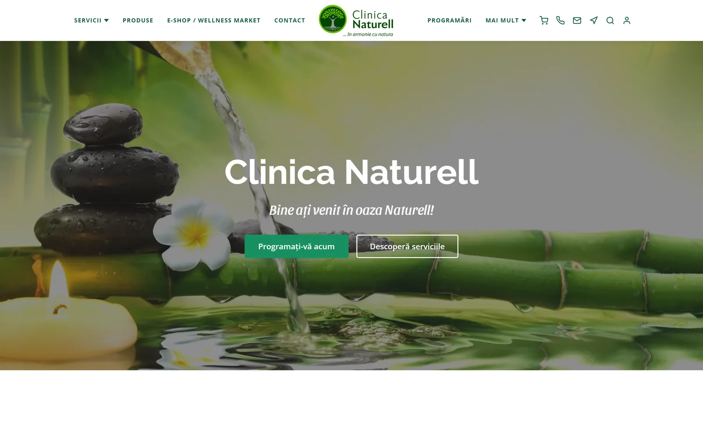

# Clinica Naturell

**A wellness clinic's website, online booking and content management — shipped without a backend, at €0 a month.** Twenty public routes and nine admin routes for a complementary-therapy clinic in Timișoara, with Firestore security rules doing the work a server usually does, and the clinic maintaining its own content without a developer in the loop.

[Live site](https://naturell.ro) · [Engineering notes](docs/engineering.md) · [Case study on my site](https://alexandru-lungu.web.app/projects/naturell)

> Client-authorized public case study, on the condition that the application source stays private. The site is in Romanian.

## My contribution

**Alexandru Lungu — Full-Stack Developer and Digital Marketing, February 2024 – present.**

I was the clinic's sole technical and marketing resource: I rebuilt the site from a hosted CMS into a React application, designed the data model and the Firestore rules, built the admin tools, ran the paid social campaigns and produced the content for them, migrated the organisation to Google Workspace with Cloudflare DNS, and automated recurring email with Google Apps Script. The clinic owns its brand, its services and its client relationships.

## Problem and users

The clinic needed appointment booking, a blog they could edit themselves, lead capture for ad campaigns and client accounts — and could not take on a server or a recurring bill. The rebuild put the authorization model into Firestore security rules, transactional email through a client-side form API, and prerendered the key routes at build time so a client-rendered app could still rank in local search.

| Audience | Implemented journey |
| --- | --- |
| Visitor | Browse six service categories and fifteen bookable sessions, read the blog, search the site (Cmd/Ctrl-K, diacritic-insensitive), book an appointment, land on a campaign page from an ad and submit a qualifying form. |
| Client | Register, verify email, sign in, reset a password, read back their own appointments and nobody else's. |
| Staff | Write and publish blog posts with live Markdown preview, review bookings, read contact-form messages, moderate testimonials, work campaign lead queues. |

## A two-minute look

1. Open [naturell.ro](https://naturell.ro), decline non-essential cookies, and notice the Google Maps embed on the contact page is replaced by a static address card — the consent store gates it.
2. Open a service category page; each carries FAQ structured data and is one of the eight routes prerendered at build time.
3. Try site search with a diacritic-free query. Admin routes need a staff account; no shared credentials are published.

## Engineering

**React 19, TypeScript, Vite, React Router 7, Tailwind CSS 4, react-markdown; Firebase (Firestore, Auth, Hosting) on the free tier; Puppeteer-based prerendering; Web3Forms; TikTok Pixel; Cloudflare DNS with SPF/DKIM for Google Workspace.**

The defining decision is **security rules as the authorization layer.** Public collections accept creates only, and only when the payload carries the required keys with the expected types; reads, updates and deletes require the admin claim. Appointments add a second read path so a signed-in client can see documents matching their own email and nothing else. Nine collections, each with its own rule block. Transactional email — the one thing that genuinely wants a server — goes through a third-party form API, fire-and-forget, so a failed notification can never block the Firestore write that is the source of truth.

The [engineering notes](docs/engineering.md) cover the rules model, the prerendering and metadata approach for a single-page app that lives on local search, a consent store that actually gates something, and the content audit that is the best story in the project.

## Quality, outcomes and status

The site has been live and maintained since 2024 at **€0 a month** infrastructure cost. Services, brands and seed articles live in typed data modules from which the navigation, service pages, booking dropdown, search index and sitemap are all derived, so publishing a new service is one edit that propagates everywhere.

Marketing outcomes, from the campaign dashboards: **246 leads from 1,375 RON of spend (5.59 RON per lead) across 299,674 impressions**, with the best campaign delivering 167 leads at 2.52 RON each; the clinic's TikTok channel grew to 2,185 followers and 11.3K likes on daily publishing, with top videos reaching 116.6K and 55.1K views. Those are platform-reported figures; no revenue attribution is claimed.

There are no automated tests in this project. Verification is by hand before each deploy.

## Source and rights

**The application source remains private because this is client work.** This repository contains only case-study writing and a screenshot of the public home page; it contains no application source, credentials, client data or campaign data beyond the aggregate figures above.

© 2026 Alexandru Lungu. All rights reserved for case-study material owned by Alexandru Lungu. Client software, branding and content remain the property of their respective rights holders. See [LICENSE](LICENSE).

**Professional profile:** [alexandru-lungu.web.app](https://alexandru-lungu.web.app) · [GitHub](https://github.com/Saandu)
